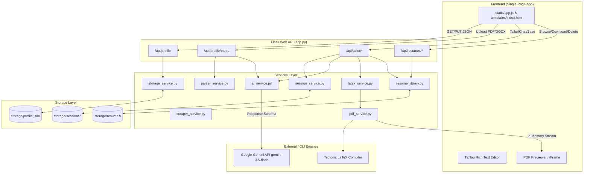

# 🤝 BuildR — Complete Project Handoff Guide

Welcome to **BuildR**! This document serves as the comprehensive technical specification, architectural guide, and operational manual for BuildR. It is designed to allow another AI coding agent or software engineer to immediately take full control of the codebase, understand every pipeline and safeguard, maintain tests, and extend functionality seamlessly.

---

## 🧭 Executive Summary & Core Philosophy

**BuildR** is a developer-centric, AI-powered Master Resume Builder and job-tailoring engine. It bridges the gap between structured career data storage, LLM-based intelligent customization, and publication-quality PDF compilation.

### Key Architectural Pillars

1. **Separation of Career Database & Rendering**:
   - The user maintains a single, comprehensive **Master Resume Profile** stored as structured JSON in [storage/profile.json](file:///c:/Users/KIIT/OneDrive/Documents/GitHub/BuildR/storage/profile.json).
   - Document rendering is completely decoupled from content storage: LaTeX templates transform validated Pydantic profile objects into clean, ATS-optimized PDFs.

2. **The "AI Decides Content, Code Renders Document" Paradigm**:
   - The LLM (Google Gemini via `google-genai` SDK) is **never** asked to generate raw LaTeX strings. Asking LLMs to generate LaTeX directly leads to unescaped syntax errors, compilation crashes, and broken layouts.
   - Instead, Gemini is constrained via **Pydantic Response Schemas** and **Constrained Decoding** to emit structured JSON containing only item selection, reordering, and bullet rephrasing.
   - Python code owns all escaping, Jinja2 templating, and LaTeX compilation via the **Tectonic** CLI.

3. **Strict Anti-Fabrication Safeguards**:
   - Resumes must be 100% truthful. The system implements a multi-layer anti-hallucination defense:
     - Prompts explicitly enforce that the Master Profile is the single source of truth.
     - Pydantic response schemas prevent arbitrary structural mutations.
     - An in-memory post-generation sanitizer ([_sanitize_tailored_output](file:///c:/Users/KIIT/OneDrive/Documents/GitHub/BuildR/services/ai_service.py#L243-L503)) fuzzy-matches generated content against the Master Profile and silently strips any invented companies, projects, skills, technologies, or metrics.
     - Unsupported job requirements are forcibly routed into a dedicated `keywords_not_included_list`.

4. **Thread-Safe & Isolated Compilation**:
   - Multi-user and concurrent requests are protected by compiling LaTeX documents inside private temporary directories ([_isolated_compile](file:///c:/Users/KIIT/OneDrive/Documents/GitHub/BuildR/app.py#L306-L325)).
   - Intermediate PDF previews are served directly from in-memory byte buffers (`io.BytesIO`) to prevent Windows file-locking race conditions during cleanup.

---

## 📁 Repository Structure Map

```text
BuildR/
├── app.py                      # Core Flask application, configuration, and API router (17 REST endpoints)
├── requirements.txt            # Production Python dependencies (Flask, Pydantic, google-genai, etc.)
├── requirements-dev.txt        # Development dependencies (pytest)
├── Procfile                    # Production process definition for Render (Gunicorn WSGI server)
├── render-build.sh             # Render deployment script (installs pinned Tectonic v0.16.9 binary)
├── README.md                   # User-facing features and quickstart documentation
├── LICENSE                     # MIT License
│
├── models/                     # Data contracts and serialization schemas (Pydantic v2)
│   ├── profile.py              # Canonical Profile schema (master database model)
│   ├── tailored_profile.py     # Gemini-safe TailoredProfile (avoids dict/additionalProperties)
│   └── tailoring_result.py     # Multi-agent output (profile, suggestions, stats, insights)
│
├── services/                   # Modular business logic layers
│   ├── ai_service.py           # Gemini API client, prompts, anti-hallucination sanitizer, job analysis
│   ├── latex_service.py        # Jinja2 environment, custom delimiters, single-pass regex escaper, HTML-to-LaTeX
│   ├── pdf_service.py          # Subprocess execution wrapper for Tectonic CLI compiler
│   ├── parser_service.py       # PDF/DOCX text extraction and text-to-HTML formatting
│   ├── scraper_service.py      # Job posting web scraper with noise stripping and fallback advice
│   ├── storage_service.py      # Disk persistence for storage/profile.json
│   ├── resume_library.py       # Catalog manager for persistent generated resumes (storage/resumes/)
│   └── session_service.py      # Scratch workspace session manager (storage/sessions/)
│
├── static/                     # SPA frontend static assets
│   ├── app.js                  # Frontend SPA router, state manager, TipTap rich text integration, live PDF viewer
│   ├── style.css               # Comprehensive CSS design system (glassmorphism, dark/light themes, animations)
│   └── favicon.*               # Favicons and web app icons
│
├── templates/                  # Single-Page Application HTML layout
│   └── index.html              # HTML markup for editor tabs, workspace, preview panel, and history view
│
├── templates_latex/            # LaTeX document template
│   └── resume.tex              # Core Jinja2 LaTeX skeleton compiled into ATS PDFs
│
├── storage/                    # Flat-file database & session workspace (git-ignored)
│   ├── profile.json            # Master profile JSON save-state
│   ├── resumes/                # Cataloged output folders (YYYYMMDD-HHMMSS_label/ containing tex, pdf, metadata.json)
│   └── sessions/               # Temporary workspace session folders (auto-cleaned after 7 days)
│
└── tests/                      # Automated test suite (102 pytest unit/integration tests)
    ├── conftest.py             # Isolated temporary directory fixtures for storage, library, & sessions
    ├── test_ai_sanitize.py     # Anti-hallucination sanitizer unit tests
    ├── test_app_routes.py      # Flask API endpoint integration tests
    ├── test_latex_service.py   # LaTeX escaping and HTML conversion tests
    ├── test_parser_service.py  # Resume text extractor tests
    ├── test_pdf_service.py     # Tectonic compilation integration tests
    ├── test_resume_library.py  # Path traversal safety & library storage tests
    └── test_session_service.py # Workspace session roundtrip & expiration tests
```

---

## 🏗️ System Architecture & Component Interaction



---

## 🔄 Core Data Pipelines

### 1. Master Profile Ingestion & Persistence Pipeline
1. **User Action**: The user either uploads an existing PDF/DOCX resume or manually enters data into the form tabs.
2. **Text Extraction**: If uploaded, [services/parser_service.py](file:///c:/Users/KIIT/OneDrive/Documents/GitHub/BuildR/services/parser_service.py) extracts raw text via `pypdf` or `python-docx`.
3. **AI Parsing**: [parse_resume_text()](file:///c:/Users/KIIT/OneDrive/Documents/GitHub/BuildR/services/ai_service.py#L653-L700) passes raw text to Gemini with `response_schema=TailoredProfile` to structure contact details, work history, education, projects, skills, certifications, and achievements.
4. **List Formatting**: `postprocess_parsed_profile()` converts plain-text list patterns into semantic HTML (`<ul><li>...</li></ul>`) so TipTap rich-text fields populate cleanly.
5. **Validation & Storage**: Incoming profile JSON is validated against the [Profile](file:///c:/Users/KIIT/OneDrive/Documents/GitHub/BuildR/models/profile.py#L309-L374) Pydantic model and persisted to disk at [storage/profile.json](file:///c:/Users/KIIT/OneDrive/Documents/GitHub/BuildR/storage/profile.json) by `save_profile()`.

### 2. Master PDF Compilation Pipeline
1. `api_generate_master_resume()` loads `Profile` from [storage/profile.json](file:///c:/Users/KIIT/OneDrive/Documents/GitHub/BuildR/storage/profile.json).
2. [render_latex()](file:///c:/Users/KIIT/OneDrive/Documents/GitHub/BuildR/services/latex_service.py#L300-L412) deep-walks the profile object:
   - Plain text fields are escaped using a single-pass regex `_LATEX_ESCAPE_RE` for all 10 LaTeX special characters (`\`, `&`, `%`, `$`, `#`, `_`, `{`, `}`, `~`, `^`).
   - Rich-text HTML fields (achievements, bullet points) are parsed with `BeautifulSoup4` and converted to LaTeX environments (`\begin{itemize}\item ... \end{itemize}`).
   - Raw URLs (e.g., GitHub, LinkedIn, portfolio links) bypass display escaping to keep `\href{url}{label}` hyperlinks valid.
3. The Jinja2 LaTeX environment (configured with custom delimiters `\VAR{}`, `\BLOCK{}`, `\COMMENT{}`) renders [templates_latex/resume.tex](file:///c:/Users/KIIT/OneDrive/Documents/GitHub/BuildR/templates_latex/resume.tex).
4. `_isolated_compile()` writes the rendered `.tex` string into a temporary per-request directory and calls `compile_pdf()` to execute `tectonic`.
5. `save_resume()` saves `.tex`, `.pdf`, and `metadata.json` into a single canonical master folder in [storage/resumes/](file:///c:/Users/KIIT/OneDrive/Documents/GitHub/BuildR/storage/resumes).

### 3. AI Tailoring Workspace Pipeline (v2 Workspace Flow)
1. **Initialization**: The user inputs a job description (or URL scraped by [services/scraper_service.py](file:///c:/Users/KIIT/OneDrive/Documents/GitHub/BuildR/services/scraper_service.py)) and tailoring preferences.
2. **Session Creation**: `session_service.create_session()` creates a unique workspace folder in [storage/sessions/<session_id>/](file:///c:/Users/KIIT/OneDrive/Documents/GitHub/BuildR/services/session_service.py).
3. **LLM Tailoring**: `tailor_resume_v2()` sends the Master Profile JSON and Job Description to Gemini (`gemini-3.5-flash`) with structured response schema [TailoringResult](file:///c:/Users/KIIT/OneDrive/Documents/GitHub/BuildR/models/tailoring_result.py#L26-L33).
4. **Anti-Hallucination Sanitization**: `_sanitize_tailored_output()` verifies the response:
   - Canonical skill matching (`_canon_skill()`) checks if skill strings match the Master Profile.
   - Any invented technologies, roles, companies, or metrics are silently stripped.
   - Missing job requirements are added to `keywords_not_included_list`.
5. **Interactive Iteration & Chat**:
   - The user can adjust draft profile fields manually in the workspace editor ([api_tailor_update_draft](file:///c:/Users/KIIT/OneDrive/Documents/GitHub/BuildR/app.py#L752-L790)) or send chat instructions to `chat_tailor_resume()`.
   - The user can create explicit named snapshots (`save_snapshot()`) and restore previous iterations (`restore_snapshot()`).
6. **Live Preview**: `/api/tailor/preview/<session_id>/<version_type>/<version_id>` compiles the active draft or snapshot on-the-fly inside an isolated temporary directory and streams the PDF bytes back to the frontend without writing temporary PDFs to permanent storage.
7. **Export**: Saving or downloading copies the compiled PDF and TeX source into the permanent [storage/resumes/](file:///c:/Users/KIIT/OneDrive/Documents/GitHub/BuildR/storage/resumes) library catalog.

---

## 📡 Complete REST API Reference

| HTTP Method | Route Endpoint | Purpose | Request Body | Success Response |
|---|---|---|---|---|
| `GET` | `/` | Serves main SPA index page | N/A | HTML Page |
| `GET` | `/favicon.ico` | Serves root favicon icon | N/A | Binary ICO file |
| `GET` | `/api/profile` | Loads current master profile | N/A | Profile JSON + `has_valid_resume` boolean |
| `PUT` | `/api/profile` | Saves master profile | Profile JSON | `{"status": "ok"}` (or 422 errors) |
| `POST` | `/api/profile/parse` | Parses uploaded resume file | Multipart `file` (PDF/DOCX) | Parsed Profile JSON |
| `POST` | `/api/resume/master` | Generates master PDF | N/A | `{"status": "ok", "id": "...", "label": "Master"}` |
| `POST` | `/api/scrape-job` | Scrapes job posting web page | `{"url": "https://..."}` | `{"status": "ok", "job_description": "..."}` |
| `POST` | `/api/analyze-job` | Extracts key skills/keywords from JD | `{"job_description": "..."}` | `{"status": "ok", "skills": [...], "keywords": [...]}` |
| `POST` | `/api/tailor/start` | Initializes tailoring workspace | `{"job_description": "...", "preferences": {...}}` | `{"session_id": "...", "suggestions": [...], ...}` |
| `POST` | `/api/tailor/chat` | Refines active draft via AI chat | `{"session_id": "...", "message": "..."}` | `{"status": "ok", "suggestions": [...], ...}` |
| `GET` | `/api/tailor/draft/<session_id>` | Returns active draft profile & metadata | N/A | `{"profile": {...}, "suggestions": [...], ...}` |
| `PUT` | `/api/tailor/draft/<session_id>` | Saves manual edits to active draft | `{"profile": {...}}` | `{"status": "ok"}` |
| `POST` | `/api/tailor/snapshot` | Creates a named snapshot | `{"session_id": "...", "name": "..."}` | `{"status": "ok", "snapshot_id": "..."}` |
| `POST` | `/api/tailor/restore` | Restores a selected snapshot | `{"session_id": "...", "snapshot_id": "..."}` | `{"status": "ok", ...}` |
| `POST` | `/api/tailor/save` | Saves draft to permanent Resume Library | `{"session_id": "..."}` | `{"status": "ok", "id": "...", "label": "..."}` |
| `POST` | `/api/tailor/download/<session_id>` | Compiles & downloads draft PDF | N/A | PDF file attachment download |
| `GET` | `/api/tailor/preview/<session_id>/<type>/<id>` | On-the-fly PDF preview stream | N/A | PDF stream (`application/pdf`) |
| `POST` | `/api/resume/tailored` | Legacy one-shot tailoring route | `{"job_description": "..."}` | `{"status": "ok", "id": "..."}` |
| `GET` | `/api/resumes` | Lists cataloged resumes | N/A | Array of metadata objects |
| `GET` | `/api/resumes/<id>/pdf` | Downloads cataloged PDF | N/A | PDF file attachment download |
| `GET` | `/api/resumes/<id>/tex` | Downloads cataloged LaTeX source | N/A | TEX file attachment download |
| `DELETE` | `/api/resumes/<id>` | Deletes cataloged resume entry | N/A | `{"status": "ok"}` |
| `PATCH` | `/api/resumes/<id>` | Renames cataloged resume label | `{"label": "New Name"}` | `{"status": "ok", "label": "..."}` |
| `POST` | `/api/resumes/<id>/duplicate` | Duplicates cataloged resume | `{"label": "Optional"}` | `{"status": "ok", "id": "..."}` |

---

## 🛡️ Security & Defensive Safeguards

### 1. Single-Pass Regex LaTeX Escaping
Sequential `str.replace()` calls can cause re-escaping bugs (e.g. replacing `\` with `\textbackslash{}` introduces literal `{` and `}` that subsequent rules would convert to `\{` and `\}`).
[services/latex_service.py](file:///c:/Users/KIIT/OneDrive/Documents/GitHub/BuildR/services/latex_service.py#L92-L139) uses a single regular expression pass (`_LATEX_ESCAPE_RE`) over the original string so replacement tokens are never re-scanned:

```python
_LATEX_ESCAPE_MAP: dict[str, str] = {
    "\\": r"\textbackslash{}",
    "&":  r"\&",
    "%":  r"\%",
    "$":  r"\$",
    "#":  r"\#",
    "_":  r"\_",
    "{":  r"\{",
    "}":  r"\}",
    "~":  r"\textasciitilde{}",
    "^":  r"\textasciicircum{}",
}
_LATEX_ESCAPE_RE = re.compile("|".join(re.escape(c) for c in _LATEX_ESCAPE_MAP))

def escape_latex(value: str) -> str:
    # Strips unprintable control characters to prevent Tectonic failures
    value = re.sub(r"[\x00-\x08\x0b\x0c\x0e-\x1f\x7f-\x9f]", "", value)
    return _LATEX_ESCAPE_RE.sub(lambda m: _LATEX_ESCAPE_MAP[m.group(0)], value)
```

### 2. Path Traversal Defenses
- **Resume Library**: [delete_resume()](file:///c:/Users/KIIT/OneDrive/Documents/GitHub/BuildR/services/resume_library.py#L320-L353) and `_validate_resume_id()` use canonical path resolution (`.resolve()`) to ensure target directories lie strictly inside `storage/resumes/`:
  ```python
  candidate = (RESUMES_DIR / resume_id).resolve()
  base = RESUMES_DIR.resolve()
  if candidate == base or not candidate.is_relative_to(base):
      raise ValueError("Invalid resume ID: path traversal detected.")
  ```
- **Session Service**: [get_session_dir()](file:///c:/Users/KIIT/OneDrive/Documents/GitHub/BuildR/services/session_service.py#L23-L48) sanitizes IDs using an explicit character allow-list (`[a-zA-Z0-9_-]`) and rejects empty results, preventing directory escalation.

### 3. Memory & Resource Safeguards
- **Max Content Length**: `app.config["MAX_CONTENT_LENGTH"] = 20 * 1024 * 1024` (20 MB) caps all incoming request payloads.
- **Scraper Ceilings**: `_MAX_RESPONSE_BYTES = 5 * 1024 * 1024` (5 MB) streams web pages and terminates early if a remote server sends excessive data.
- **Session Cleanup**: `cleanup_expired_sessions()` automatically removes temporary session directories older than 7 days at module import time.
- **Tectonic Timeout**: Subprocess calls to Tectonic are capped at 120 seconds.

---

## ⚙️ Environment & Configuration

The application uses `python-dotenv` to load environment variables from `.env` at startup in `app.py`:

```env
# Google Gemini API key (Required)
GEMINI_API_KEY=your_actual_gemini_api_key_here

# Enable Flask auto-reload + interactive debugger (Default: 0 / False)
FLASK_DEBUG=1

# Port for Flask development server (Default: 5000)
PORT=5000

# Gemini API call timeout in milliseconds (Default: 90000)
GEMINI_TIMEOUT_MS=90000

# Secret key for signing session cookies (Generated randomly if omitted)
SECRET_KEY=your_secret_key_here
```

---

## 🛠️ Local Development & Execution

### 1. Environment Setup
```bash
# Clone repository
git clone https://github.com/<your-username>/BuildR.git
cd BuildR

# Create virtual environment
python -m venv env

# Activate virtual environment
# Windows (PowerShell):
.\env\Scripts\Activate.ps1
# macOS/Linux:
source env/bin/activate

# Install production and development dependencies
pip install -r requirements.txt -r requirements-dev.txt
```

### 2. Tectonic Compiler Verification
BuildR requires the **Tectonic** CLI binary to compile LaTeX into PDFs.
```bash
# Verify installation
tectonic --version
```
If Tectonic is missing, install it via:
- **Windows**: `winget install --id=AnotherRedFox.Tectonic -e`
- **macOS**: `brew install tectonic`
- **Linux**: `cargo install tectonic` or `sudo apt install tectonic`
- **Cross-Platform**: `conda install -c conda-forge tectonic`

### 3. Running the Development Server
```bash
python app.py
```
Access the application in your browser at `http://127.0.0.1:5000/`.

---

## 🧪 Running Tests & Verification

BuildR features a 102-test pytest suite that covers all core modules, routing endpoints, sanitization rules, and LaTeX rendering logic.

```bash
# Execute full test suite
.\env\Scripts\python.exe -m pytest
```

> [!NOTE]
> Tests that perform real PDF compilation with Tectonic are automatically skipped if the `tectonic` binary is not found on the system. Tests involving Gemini API logic mock or exercise the sanitizer functions directly, so no live API calls are made during `pytest`.

---

## ☁️ Deployment Architecture (Render.com)

BuildR is pre-configured for deployment as a Python Web Service on **Render**.

### Deployment Settings
- **Build Command**: `./render-build.sh`
- **Start Command**: `gunicorn --bind 0.0.0.0:$PORT app:app` (defined in [Procfile](file:///c:/Users/KIIT/OneDrive/Documents/GitHub/BuildR/Procfile))
- **Environment Variables**: Set `GEMINI_API_KEY` in the Render dashboard.

### How Tectonic Works on Render
[render-build.sh](file:///c:/Users/KIIT/OneDrive/Documents/GitHub/BuildR/render-build.sh) downloads a pinned release of Tectonic (v0.16.9) directly from GitHub Releases and places the executable binary at `$HOME/tectonic`.

`pdf_service.py`'s binary locator `_find_tectonic()` automatically checks `Path.home() / "tectonic"`:
```python
home_path_unix = Path.home() / "tectonic"
if home_path_unix.exists():
    return str(home_path_unix)
```
This enables zero-config binary discovery on Linux container hosts without requiring `root` permissions or global `PATH` modifications.

---

## 💡 Gotchas & Developer Maintenance Checklist

When modifying or extending BuildR, keep the following critical implementation rules in mind:

1. **Gemini Schema Restrictions (`additionalProperties`)**:
   - The Gemini Developer API's structured output generator rejects JSON schemas containing `additionalProperties` (which standard Pydantic `Dict[str, Any]` fields generate).
   - If adding fields to AI response models, **never use `dict`**. Use explicit lists of objects (e.g. `list[TailoredLink]` instead of `dict[str, str]` as demonstrated in [models/tailored_profile.py](file:///c:/Users/KIIT/OneDrive/Documents/GitHub/BuildR/models/tailored_profile.py)).

2. **Windows File Locking & Temp Directory PDF Previewing**:
   - In `api_tailor_preview()`, compiled PDF files must be read into memory via `pdf_filepath.read_bytes()` before the `_isolated_compile` context manager unwinds and deletes the temporary directory.
   - Returning `send_file(file_path)` directly causes a `PermissionError` on Windows because the file handle remains open when the temp directory cleanup attempts to delete it.

3. **Preserving Rich-Text Achievements & List Markers**:
   - Achievements are stored as HTML string snippets (`<ul><li>...</li></ul>`).
   - LLMs tend to strip HTML formatting when rephrasing text. The anti-hallucination sanitizer `_sanitize_tailored_output()` explicitly detects if HTML list tags were stripped and re-wraps the output in `<ul>` or `<ol>` tags before passing data to the LaTeX converter.

4. **URL Escaping in LaTeX Hyperlinks**:
   - In `latex_service.py`, `\href{url}{label}` needs the raw URL to remain unescaped while escaping the display label. Passing raw URLs through `escape_latex()` will mangle query strings (`&`, `%`, `#`) and break hyperlinks.

5. **Single Master Resume Catalog Entry**:
   - Unlike tailored resumes (which are kept as individual historical artifacts per job application), generating a new Master Resume removes previous "Master" entries via `delete_resumes_by_type("master")` to avoid accumulating duplicate master entries.

---

## 🏁 Summary for Next Maintainer Agent

You have full ownership of BuildR! The code is modular, robustly typed with Pydantic, thoroughly covered by unit tests, and well-documented throughout. When fulfilling future user requests:
- Refer to `models/profile.py` for schema modifications.
- Modify `services/ai_service.py` for prompt tuning or anti-hallucination tweaks.
- Adjust `templates_latex/resume.tex` or `services/latex_service.py` for PDF styling changes.
- Always run `.\env\Scripts\python.exe -m pytest` to ensure zero regressions before finalizing changes.
